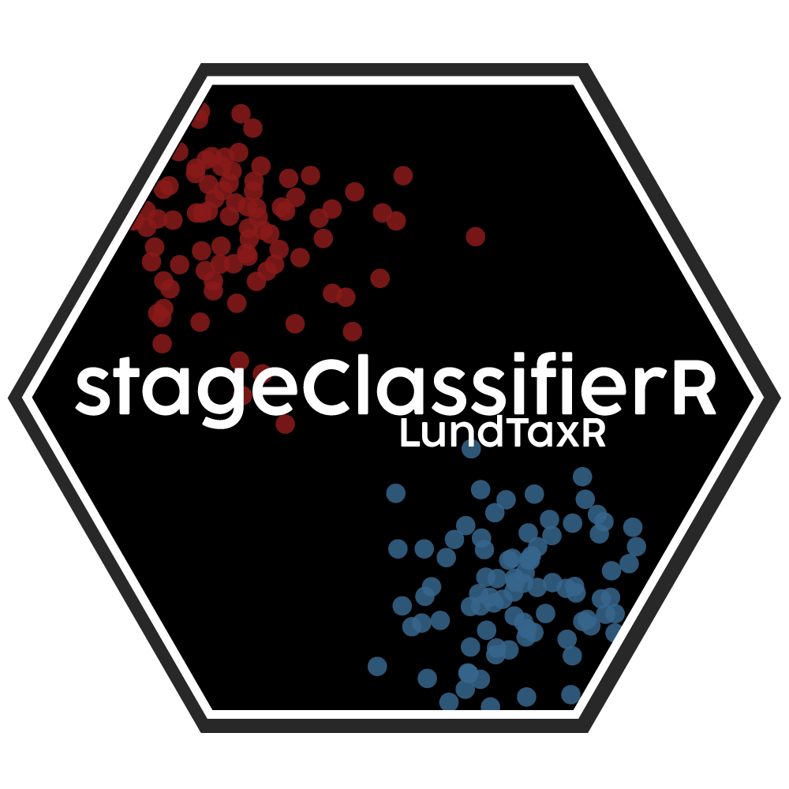

# stageClassifieR



<!-- badges: start -->

[](https://www.tidyverse.org/lifecycle/#experimental)
[](https://opensource.org/licenses/MIT)

<!-- badges: end -->

## Overview

**stageClassifieR** is an R package for predicting bladder cancer stage classification, specifically distinguishing between muscle-invasive bladder cancer (MIBC) and non-muscle-invasive bladder cancer (NMIBC). The package uses a random forest classifier trained on gene expression data and molecular signatures to provide accurate stage predictions.

## Key Features

- 🎯 **Accurate Classification**: Predicts MIBC vs NMIBC with high precision using machine learning
- 🧬 **Molecular Integration**: Incorporates gene expression and molecular signatures
- 🔗 **LundTaxR Compatible**: Seamlessly integrates with LundTaxR molecular subtyping
- 📊 **Probability Scores**: Returns prediction probabilities for confidence assessment
- ⚙️ **Flexible Thresholds**: Customizable classification thresholds for different use cases

## Installation

You can install the development version of stageClassifieR from [GitHub](https://github.com/) with:

```r
# install.packages("devtools")
devtools::install_github("mattssca/stageClassifieR")
```

## Dependencies

stageClassifieR requires the following packages:

- **LundTaxR**: For molecular subtype classification
- **dplyr**: For data manipulation
- **tibble**: For data frame operations
- **randomForest**: For the underlying classification model

## Quick Start

### Basic Usage

```r
library(stageClassifieR)
library(LundTaxR)

# First, get molecular classifications from LundTaxR
lundtax_predictions <- classify_samples(expression_data = your_expression_matrix)

# Predict bladder cancer stage
stage_results <- predict_stage(lundtax_predictions)

# View results
head(stage_results)
#>   sample_id prediction probability
#> 1  sample1       mibc       0.85
#> 2  sample2      nmibc       0.23
#> 3  sample3       mibc       0.92

# Summary of predictions
table(stage_results$prediction)
#> mibc nmibc 
#>   45    55
```

### Advanced Usage

#### Predict Specific Samples

```r
# Select specific samples for prediction
selected_samples <- c("sample1", "sample5", "sample10")

stage_results <- predict_stage(
  these_predictions = lundtax_predictions,
  these_sample_ids = selected_samples
)
```

#### Custom Expression Data

```r
# Use your own expression data instead of data from LundTaxR
stage_results <- predict_stage(
  these_predictions = lundtax_predictions,
  expression_data = my_custom_expression_matrix
)
```

#### Adjust Classification Threshold

```r
# Use stricter threshold for MIBC classification
stage_results <- predict_stage(
  these_predictions = lundtax_predictions,
  this_threshold = 0.7  # Default is 0.596
)

# More samples will be classified as NMIBC with higher threshold
```

## Input Requirements

### Expression Data Format

Your gene expression data should be formatted as:

- **Rows**: Genes (with gene symbols as rownames)
- **Columns**: Samples (with sample IDs as column names)
- **Values**: Log2-transformed expression values

```r
# Example expression matrix format
expression_data[1:5, 1:3]
#>        sample1 sample2 sample3
#> ACTB     12.5    11.8    12.1
#> GAPDH    13.2    13.0    13.4
#> TP53      8.9     9.2     8.7
#> BRCA1     7.5     7.8     7.2
#> MYC      10.1    10.5     9.8
```

### LundTaxR Predictions

The `predict_stage()` function requires a LundTaxR prediction object containing:

- Molecular subtype classifications (5-class system)
- Signature scores (proliferation, progression, molecular grades)
- Optional: expression data

## Output

The function returns a data frame with three columns:

| Column          | Type      | Description                              |
| --------------- | --------- | ---------------------------------------- |
| `sample_id`   | Character | Sample identifier                        |
| `prediction`  | Character | Stage prediction ("mibc" or "nmibc")     |
| `probability` | Numeric   | Probability of MIBC classification (0-1) |

## Model Details

### Algorithm

- **Model Type**: Random Forest classifier
- **Training Features**:
  - Top predictive genes from expression data
  - Molecular subtype classifications (5-class)
  - Signature scores (proliferation, progression, molecular grades)
- **Default Threshold**: 0.596 (optimized for balanced accuracy)

### Performance

The classifier was trained and validated on Uroscanseq data:

- **Training Set**: 200 samples (100 NMIBC and 100 MIBC)
- **Accuracy**: 87%
- **Sensitivity**: 78% (MIBC detection)
- **Specificity**: 87% (NMIBC detection)
- **Balanced Accuracy:** 83%

## Clinical Interpretation

### MIBC (Muscle-Invasive Bladder Cancer)

- More aggressive cancer type
- Typically requires radical treatment
- **High probability scores** (≥0.596) suggest MIBC

### NMIBC (Non-Muscle-Invasive Bladder Cancer)

- Less aggressive cancer type
- Often managed with conservative treatment
- **Low probability scores** (<0.596) suggest NMIBC

⚠️ **Important**: This tool is for research purposes only and should not be used for clinical decision-making without appropriate validation.

## Troubleshooting

### Common Issues

**Error: Missing LundTaxR predictions**

```r
# Make sure to run LundTaxR classification first
lundtax_predictions <- LundTaxR::classify_samples(your_data)
stage_results <- predict_stage(lundtax_predictions)
```

**Error: Sample ID mismatch**

```r
# Ensure sample IDs match between expression data and predictions
colnames(expression_data) <- make.names(colnames(expression_data))
```

**Warning: Missing features**

```r
# Missing features are automatically imputed using training data means
# This warning is informational and doesn't affect results
```

## Citation

If you use stageClassifieR in your research, please cite:

```
Adam Mattsson et al. (2025). stageClassifieR: Machine Learning-Based 
Bladder Cancer Stage Classification. R package version 0.1.0.
https://github.com/yourusername/stageClassifieR
```

## Related Packages

- **[LundTaxR](https://github.com/mattssca/LundTaxR)**: Molecular subtype classification for bladder cancer
- **[randomForest](https://cran.r-project.org/package=randomForest)**: Random forest implementation
- **[dplyr](https://dplyr.tidyverse.org/)**: Data manipulation tools

## Contributing

Contributions are welcome! Please see our [Contributing Guide](CONTRIBUTING.md) for details.

### Development Setup

```r
# Clone the repository
git clone https://github.com/yourusername/stageClassifieR.git
cd stageClassifieR

# Install development dependencies
devtools::install_dev_deps()

# Run tests
devtools::test()

# Check package
devtools::check()
```

## License

This project is licensed under the MIT License - see the [LICENSE](LICENSE) file for details.

## Support

- 🐛 **Bug reports**: [GitHub Issues](https://github.com/yourusername/stageClassifieR/issues)
- 💬 **Questions**: [GitHub Discussions](https://github.com/yourusername/stageClassifieR/discussions)
- 📧 **Email**: adam.mattsson@med.lu.se

---

**Developed by Adam Mattsson** | **2025**
